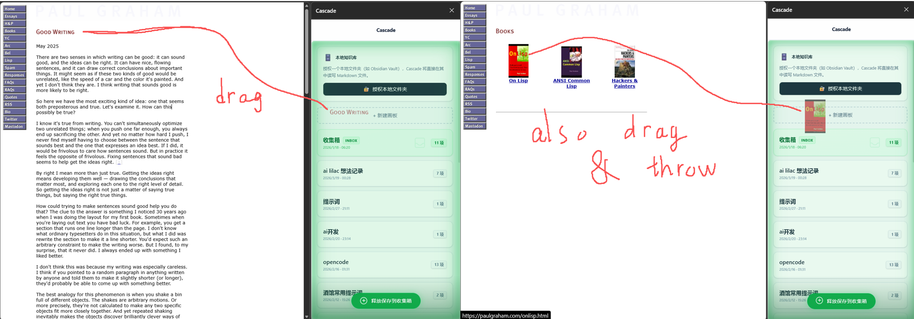

# Cascade

Cascade 是一个 Chrome / Edge 侧边栏扩展，用来把网页上的文本、图片和链接快速收集到本地缓冲区，并导出为 Obsidian Canvas。


## 项目定位

- 面向需要边浏览边收集资料的用户
- 所有数据默认保存在本地浏览器 `IndexedDB`
- 重点能力是“采集 → 整理 → 导出”
- 额外支持本地 Markdown 项目模式

## 当前能力

- 拖拽采集网页文本、图片、链接
- 粘贴采集文本、图片、URL
- 使用 `Inbox` 作为默认收集箱
- 编辑文本卡片并保留原始版本
- 删除卡片并在短时间内撤销
- 导出为 Obsidian Canvas ZIP（含 `attachments/`）
- 授权本地文件夹后创建 Markdown 项目并直接编辑 `.md`

## 快速开始

### 直接使用

1. 下载发布包并解压，得到 `dist/`
2. 打开 `chrome://extensions/`
3. 开启“开发者模式”
4. 选择“加载已解压的扩展程序”
5. 载入项目的 `dist/` 目录

### 本地开发

```bash
npm install
npm run dev
```

开发模式下，Vite 会生成并持续更新 `dist/`。然后同样在扩展管理页加载 `dist/`。

## 基本使用

1. 打开扩展侧边栏
2. 在首页把内容拖入 `Inbox`，或先新建项目
3. 通过拖拽或粘贴收集文本、图片、链接
4. 在项目页查看、编辑、删除卡片
5. 点击“导出”生成 Obsidian Canvas ZIP

## 数据与隐私

- 数据默认只保存在本地浏览器中
- 正常关闭浏览器、刷新扩展、重启电脑不会清空数据
- 卸载扩展通常会删除对应本地存储
- 重要内容建议及时导出备份

## 文档导航

- 文档总览：`docs/README.md`
- 架构说明：`docs/ARCHITECTURE.md`
- 用户指南：`docs/USER_GUIDE.md`
- 参考手册：`docs/REFERENCE.md`
- 路线图：`docs/ROADMAP.md`

## 技术栈

- React 19
- TypeScript 5
- Vite 7 + CRXJS
- Dexie
- Tailwind CSS 4
- JSZip
- BlockNote

## 许可证

MIT
