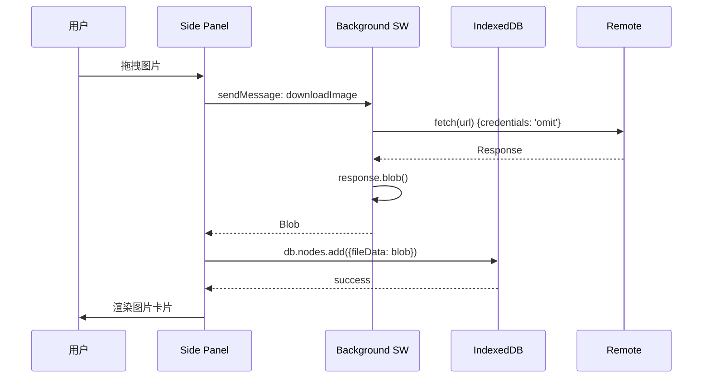

# 技术架构设计

**版本**: 2.0  
**最后更新**: 2026-01-18

---

## 1. 技术栈选型

### 1.1 核心技术栈

| 模块 | 选型 | 版本 | 决策理由 |
|------|------|------|----------|
| 构建框架 | **React** | 18+ | 组件化开发，生态丰富 |
| 构建工具 | **Vite** | 5+ | 极速 HMR，开发体验好 |
| 扩展构建 | **CRXJS** | latest | Vite 插件，Manifest V3 支持 |
| 拖拽库 | **@dnd-kit** | latest | 轻量、可访问性好、替代 React DnD |
| 数据库 | **Dexie.js** | 4+ | IndexedDB 封装，支持 Blob 存储 |
| 样式 | **Tailwind CSS** | 3+ | 原子化 CSS，快速开发 |
| 打包 | **JSZip** | 3+ | 纯前端 ZIP 生成 |

### 1.2 为什么不选...

| 方案 | 不选理由 |
|------|----------|
| React Flow | 过于重型，我们是流式列表不是画布 |
| localStorage | 只有 5MB 限制，无法存储图片 |
| Redux | 状态简单，Zustand/原生 State 足够 |
| SaaS 后端 | Local-First 原则，无需服务器 |

---

## 2. 数据存储设计

### 2.1 IndexedDB Schema (Dexie)

```typescript
// src/sidepanel/services/db.ts

interface Project {
  id: string;          // UUID
  name: string;        // 画板名称
  createdAt: number;
  updatedAt: number;
  isInbox?: boolean;   // 是否为默认收集箱
}

interface CanvasNode {
  id: string;          // UUID
  projectId: string;   // 关联的画板 ID
  type: 'text' | 'file' | 'link';
  order: number;       // 排序索引

  // 内容数据
  text?: string;       // 文本内容
  fileData?: Blob;     // 图片二进制 (不索引！)
  fileName?: string;   // 文件名
  url?: string;        // 链接 URL

  // 元数据
  sourceUrl?: string;  // 来源网页 URL
  sourceIcon?: string; // 来源 Favicon
  createdAt: number;
}

// Dexie Schema 定义
const dbSchema = {
  projects: '++id, name, updatedAt, isInbox',
  // ⚠️ 注意：fileData 字段不索引，避免对 Blob 创建索引导致崩溃
  nodes: '++id, projectId, type, order, createdAt'
}
```

### 2.2 存储限制

| 浏览器 | IndexedDB 配额 | 说明 |
|--------|---------------|------|
| Chrome | ~5-10GB/域名 | 临时存储 + IndexedDB 共享 |
| Edge | 与 Chrome 相同 | - |
| Firefox | ~2GB/域名 | 相对严格 |
| Safari | ~1GB/域名 | 相对严格 |

**实际使用估算**：
- 小图片（图标）：~1KB
- 普通截图：~500KB
- 高清照片：~5MB
- 100 张小图 + 10 张大图 ≈ 70MB（远低于配额）

### 2.3 Blob 存储最佳实践

```typescript
// ✅ 正确做法
await db.nodes.add({
  id: uuid(),
  projectId: 'xxx',
  type: 'file',
  fileData: blob,  // 直接存 Blob，不索引
  fileName: 'image.png'
})

// ❌ 错误做法 - 不要索引 fileData
nodes: '++id, projectId, fileData'  // 会崩溃！
```

---

## 3. 核心模块设计

### 3.1 混合拖拽系统

```
┌─────────────────────────────────────────────────────┐
│                  DropZone 组件                       │
│  ┌─────────────────────────────────────────────┐    │
│  │  外部拖拽 (External Drop)                    │    │
│  │  - 监听 window.drop 事件                     │    │
│  │  - 解析 DataTransfer                         │    │
│  │  - 默认插入列表底部 (order = Max + 1)        │    │
│  └─────────────────────────────────────────────┘    │
│  ┌─────────────────────────────────────────────┐    │
│  │  内部排序 (Internal Sort)                    │    │
│  │  - @dnd-kit SortableContext                  │    │
│  │  - 拖拽卡片调整顺序                          │    │
│  │  - 计算新 order 值 (中间值或重排)             │    │
│  └─────────────────────────────────────────────┘    │
└─────────────────────────────────────────────────────┘
```

### 3.2 图片处理流程



### 3.3 粘贴处理逻辑

```typescript
// 支持的粘贴类型优先级
1. text/html      → 解析 HTML 提取图片/链接
2. text/uri-list  → URL 链接
3. text/plain     → 纯文本
4. Files (image/*) → 剪贴板图片
```

### 3.4 导出：List-to-Grid 算法

```typescript
// 核心参数
const CONFIG = {
  COLS: 4,           // 4 列网格
  CARD_WIDTH: 400,   // 卡片宽度
  GAP: 50,           // 间距
  HEIGHT_TEXT: 200,  // 文本卡片高度
  HEIGHT_IMAGE: 300, // 图片卡片高度
  HEIGHT_LINK: 150   // 链接卡片高度
}

// 一维转二维
nodes.forEach((node, index) => {
  const col = index % COLS
  const row = Math.floor(index / COLS)
  
  return {
    x: col * (CARD_WIDTH + GAP),
    y: row * (HEIGHT + GAP),
    width: CARD_WIDTH,
    height: estimateHeight(node.type)
  }
})
```

---

## 4. 组件架构

### 4.1 Side Panel 组件树

```
App
├── ProjectList (画板列表页)
│   └── ProjectCard (项目卡片)
│       └── DeleteButton
├── CardStream (卡片视图页)
│   ├── Header (Sticky)
│   │   ├── BackButton
│   │   ├── ProjectTitle
│   │   └── ExportButton
│   ├── ScrollableArea
│   │   ├── SortableContext (@dnd-kit)
│   │   │   ├── TextCard
│   │   │   ├── ImageCard
│   │   │   └── LinkCard
│   │   └── DropZone (底部提示)
│   └── Toast (撤销提示)
└── DropZoneOverlay (首页收集箱模式)
```

### 4.2 关键组件职责

| 组件 | 职责 |
|------|------|
| `DropZone.tsx` | 处理外部拖拽/粘贴，霓虹光效反馈 |
| `TextCard.tsx` | 文本渲染、折叠/展开、来源显示 |
| `ImageCard.tsx` | 图片渲染、Loading/Error 状态 |
| `LinkCard.tsx` | 链接卡片、Favicon 获取 |
| `ProjectList.tsx` | 项目列表、Inbox 置顶、特殊样式 |

---

## 5. 性能优化

### 5.1 内存管理

- URL.createObjectURL 创建的 Blob URL 要及时 revoke
- 大量图片时采用虚拟滚动（未来优化）
- 导出时流式处理 ZIP（避免一次性加载所有 Blob）

### 5.2 数据库优化

- 使用 `useLiveQuery` 实现响应式更新
- 批量操作使用 `db.transaction()`
- 定期清理无用的旧项目

### 5.3 渲染优化

- React.memo 缓存卡片组件
- 图片懒加载（Intersection Observer）
- Tailwind PurgeCSS 减少 CSS 体积

---

## 6. 安全与隐私

| 方面 | 策略 |
|------|------|
| 数据存储 | 100% 本地 IndexedDB，无云端同步 |
| 网络请求 | Background Script 代理，避免 CORS |
| 权限最小化 | 仅申请 sidePanel、storage 权限 |
| 用户数据 | 无账户体系、无追踪、无分析 |

---

## 7. 参考资源

- [React 官方文档](https://react.dev/)
- [Dexie.js 文档](https://dexie.org/)
- [@dnd-kit 文档](https://dndkit.com/)
- [CRXJS 文档](https://crxjs.dev/vite-plugin)
- [Chrome Extension 文档](https://developer.chrome.com/docs/extensions/)
